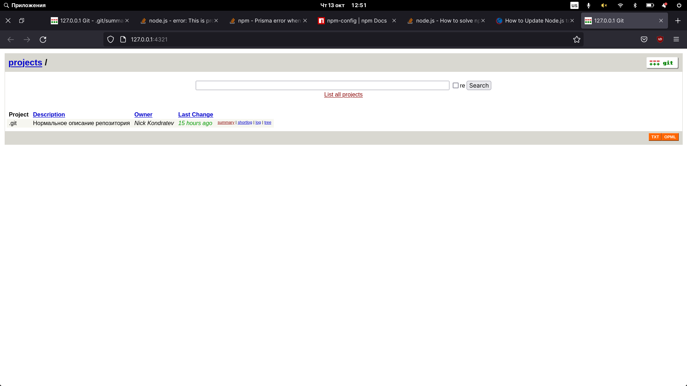

<!-- report name -->
# Title: Devtools report lab-2

## Date: 2022-10-13

## Task 1

Запустите локальный веб-визуализатор репозитория и сделайте так, чтобы в нём отображалось нормальное описание репозитория.




## Task 2

Перенесите все коммиты, находящиеся в ветке ci, в ветку master с объединением всех коммитов в один и изменением сообщения таким образом, чтобы оно полностью описывало все вносимые изменения. Удалите ветку ci

<!-- code -->
```bash
~/Downloads/mobile-dev-backend master ❯ git branch                                                                                            1m 47s 19:27:58
~/Downloads/mobile-dev-backend master ❯ git checkout ci                                                                                              19:28:05
Переключились на ветку «ci»
~/Downloads/mobile-dev-backend ci ❯ git rebase master                                                                                                19:28:10
First, rewinding head to replay your work on top of it...
Применение: chore: add simple CI build pipeline
Применение: chore: try to fix deploy error
~/Downloads/mobile-dev-backend ci ❯ git brach -d  
git: 'brach' is not a git command. See 'git --help'.
~/Downloads/mobile-dev-backend master ❯ git branch -d ci                                                                                          8s 19:48:31
error: Ветка «ci» не слита полностью.
Если вы уверены, что хотите ее удалить, запустите «git branch -D ci».
~/Downloads/mobile-dev-backend master ❯ git branch -D ci
```

`git rebase -i HEAD~2`


