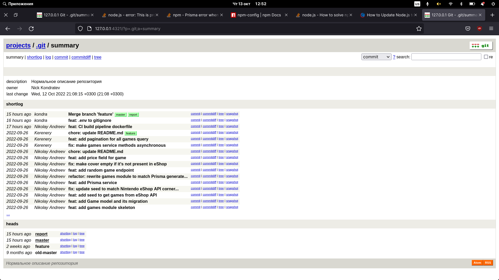

<!-- report name -->
# Title: Devtools report lab-2

## Date: 2022-10-13

## Task 1

Запустите локальный веб-визуализатор репозитория и сделайте так, чтобы в нём отображалось нормальное описание репозитория.




## Task 2

Перенесите все коммиты, находящиеся в ветке ci, в ветку master с объединением всех коммитов в один и изменением сообщения таким образом, чтобы оно полностью описывало все вносимые изменения. Удалите ветку ci

<!-- code -->
```bash
~/Downloads/mobile-dev-backend master ❯ git branch                                                                                            1m 47s 19:27:58
~/Downloads/mobile-dev-backend master ❯ git checkout ci                                                                                              19:28:05
Переключились на ветку «ci»
~/Downloads/mobile-dev-backend ci ❯ git rebase master                                                                                                19:28:10
First, rewinding head to replay your work on top of it...
Применение: chore: add simple CI build pipeline
Применение: chore: try to fix deploy error
~/Downloads/mobile-dev-backend ci ❯ git brach -d  
git: 'brach' is not a git command. See 'git --help'.
~/Downloads/mobile-dev-backend master ❯ git branch -d ci                                                                                          8s 19:48:31
error: Ветка «ci» не слита полностью.
Если вы уверены, что хотите ее удалить, запустите «git branch -D ci».
~/Downloads/mobile-dev-backend master ❯ git branch -D ci
```

`git rebase -i HEAD~2`


## Task 3

`git log --oneline --graph --decorate --all --reflog`


`git checkout 0e9cd7c`


## Task 4

```

git blame -L 32,32  prisma/seed.ts
3c82961d (Nikolay Andreev 2021-12-20 00:28:11 +0300 32)      rating: game.age_rating_sorting_i

```

## Task 5

```bash
~/Downloads/mobile-dev-backend master  ❯ npm run test                                                                                           46s 20:30:06

> mobile-dev-backend@0.0.1 test
> jest

 FAIL  src/prisma/prisma.service.spec.ts
  ● Test suite failed to run

    Your test suite must contain at least one test.

      at onResult (../node_modules/@jest/core/build/TestScheduler.js:175:18)
      at ../node_modules/@jest/core/build/TestScheduler.js:316:17
      at ../node_modules/emittery/index.js:260:13
          at Array.map (<anonymous>)
      at Emittery.emit (../node_modules/emittery/index.js:258:23)

 FAIL  src/app.controller.spec.ts (5.192 s)
  ● AppController › root › should return "Hello World!"

    expect(received).toBe(expected) // Object.is equality

    Expected: "Hello World!"
    Received: "Hello Universe!"

      17 |   describe('root', () => {
      18 |     it('should return "Hello World!"', () => {
    > 19 |       expect(appController.getHello()).toBe('Hello World!');
         |                                        ^
      20 |     });
      21 |   });
      22 | });

      at Object.<anonymous> (app.controller.spec.ts:19:40)

Test Suites: 2 failed, 2 total
Tests:       1 failed, 1 total
Snapshots:   0 total
Time:        5.612 s
Ran all test suites.
~/Downloads/mobile-dev-backend master  ❯ git bisect start                                                                                        7s 20:30:22
~/Downloads/mobile-dev-backend master | bisect ❯ git bisect reset                                                                                    20:32:06
M	package-lock.json
Уже на «master»
~/Downloads/mobile-dev-backend master  ❯ git log --all --decorate --oneline --graph                                                                 20:32:19
~/Downloads/mobile-dev-backend master  ❯ git checkout old-master                                                                                21s 20:32:45
error: Ваши локальные изменения в указанных файлах будут перезаписаны при переключении на состояние:
	package-lock.json
Сделайте коммит или спрячьте ваши изменения перед переключением веток.
Прерываю
~/Downloads/mobile-dev-backend master  ❯ git reset --hard HEAD~1                                                                                    20:32:55
Указатель HEAD сейчас на коммите 48330aa chore: update README.md
~/Downloads/mobile-dev-backend master ❯ git reflog                                                                                                   20:33:07
~/Downloads/mobile-dev-backend master ❯ git reset --hard HEAD@{1}                                                                                 9s 20:33:58
Указатель HEAD сейчас на коммите 646fe80 feat: CI build pipeline dockerfile
~/Downloads/mobile-dev-backend master ❯ git log --all --decorate --oneline --graph                                                                   20:34:16
~/Downloads/mobile-dev-backend master ❯ git checkout old-master                                                                                      20:34:24
Переключились на ветку «old-master»
~/Downloads/mobile-dev-backend old-master ❯ git reset --hard HEAD~1                                                                                  20:34:32
Указатель HEAD сейчас на коммите 0e9cd7c Initiate repository
~/Downloads/mobile-dev-backend old-master ❯ git log --all --decorate --oneline --graph                                                               20:34:45
~/Downloads/mobile-dev-backend old-master ❯ git --no-pager log --all --decorate --oneline --graph                                                29s 20:35:33
* 646fe80 (master) feat: CI build pipeline dockerfile
* 48330aa chore: update README.md
* 1b8279c fix: make cover empty if it's not present in eShop
| * 12c17ba (feature) chore: update README.md
| * f099927 feat: add pagination for all games query
| * 2cd3129 fix: make games service methods asynchronous
|/  
* 9dc1ed9 feat: add price field for game
* 93d7a2e feat: add random game endpoint
* bf7965e refactor: rewrite games module to match Prisma generated code and main task
* 5d8f66e feat: add Prisma service
* 9100bc4 fix: update seed to match Nintendo eShop API corner cases
* 3c82961 feat: add seed to get games from eShop API
* a57543b feat: add Game model and its migration
* 15d2a11 feat: add games module skeleton
* 024877a chore: add Prisma packages
* 8673a61 chore: initiate repository
* 0e9cd7c (HEAD -> old-master) Initiate repository
~/Downloads/mobile-dev-backend old-master ❯ git bisect                                                                                               20:36:02
использование: git bisect [help|start|bad|good|new|old|terms|skip|next|reset|visualize|view|replay|log|run]
~/Downloads/mobile-dev-backend old-master ❯ git checkout master                                                                                      20:36:11
Переключились на ветку «master»
~/Downloads/mobile-dev-backend master ❯ git bisect start                                                                                             20:36:25
~/Downloads/mobile-dev-backend master | bisect ❯ git bisect bad 646fe80                                                                              20:36:35
~/Downloads/mobile-dev-backend master | bisect ❯ git bisect good 8673a61                                                                             20:36:55
Бинарный поиск: 5 редакций осталось проверить после этой (примерно 3 шага)
[5d8f66e40942eddf200facecef45316924bbdb4f] feat: add Prisma service
~/Downloads/mobile-dev-backend feature~6 | bisect ❯ npm run test                                                                                     20:37:09

> mobile-dev-backend@0.0.1 test
> jest

 FAIL  src/app.controller.spec.ts
  AppController
    root
      ✕ should return "Hello World!" (19 ms)

  ● AppController › root › should return "Hello World!"

    expect(received).toBe(expected) // Object.is equality

    Expected: "Hello World!"
    Received: "Hello Universe!"

      17 |   describe('root', () => {
      18 |     it('should return "Hello World!"', () => {
    > 19 |       expect(appController.getHello()).toBe('Hello World!');
         |                                        ^
      20 |     });
      21 |   });
      22 | });

      at Object.<anonymous> (app.controller.spec.ts:19:40)

Test Suites: 1 failed, 1 total
Tests:       1 failed, 1 total
Snapshots:   0 total
Time:        2.873 s, estimated 6 s
Ran all test suites.
~/Downloads/mobile-dev-backend feature~6 | bisect ❯ git bisect bad                                                                                4s 20:37:55
Бинарный поиск: 2 редакции осталось проверить после этой (примерно 2 шага)
[a57543b9a4125314662084ae278c2fed07cdd54a] feat: add Game model and its migration
~/Downloads/mobile-dev-backend bisect/bad~3 | bisect ❯ npm run test                                                                                  20:38:23

> mobile-dev-backend@0.0.1 test
> jest

 PASS  src/app.controller.spec.ts
  AppController
    root
      ✓ should return "Hello World!" (17 ms)

Test Suites: 1 passed, 1 total
Tests:       1 passed, 1 total
Snapshots:   0 total
Time:        2.948 s, estimated 3 s
Ran all test suites.
~/Downloads/mobile-dev-backend bisect/bad~3 | bisect ❯ git bisect good                                                                            4s 20:38:37
Бинарный поиск: 0 редакций осталось проверить после этой (примерно 1 шаг)
[9100bc42e01e1972affceec1c2f26800df4089df] fix: update seed to match Nintendo eShop API corner cases
~/Downloads/mobile-dev-backend bisect/bad~1 | bisect ❯ npm run test                                                                                  20:38:45

> mobile-dev-backend@0.0.1 test
> jest

 FAIL  src/app.controller.spec.ts
  AppController
    root
      ✕ should return "Hello World!" (19 ms)

  ● AppController › root › should return "Hello World!"

    expect(received).toBe(expected) // Object.is equality

    Expected: "Hello World!"
    Received: "Hello Universe!"

      17 |   describe('root', () => {
      18 |     it('should return "Hello World!"', () => {
    > 19 |       expect(appController.getHello()).toBe('Hello World!');
         |                                        ^
      20 |     });
      21 |   });
      22 | });

      at Object.<anonymous> (app.controller.spec.ts:19:40)

Test Suites: 1 failed, 1 total
Tests:       1 failed, 1 total
Snapshots:   0 total
Time:        2.854 s, estimated 3 s
Ran all test suites.
~/Downloads/mobile-dev-backend bisect/bad~1 | bisect ❯ git bisect bad                                                                             4s 20:38:57
Бинарный поиск: 0 редакций осталось проверить после этой (примерно 0 шагов)
[3c82961d432a69ff82d5fc958b841a54cb4c6234] feat: add seed to get games from eShop API
~/Downloads/mobile-dev-backend bisect/bad~1 | bisect ❯ npm run test                                                                                  20:39:01

> mobile-dev-backend@0.0.1 test
> jest

 FAIL  src/app.controller.spec.ts
  AppController
    root
      ✕ should return "Hello World!" (22 ms)

  ● AppController › root › should return "Hello World!"

    expect(received).toBe(expected) // Object.is equality

    Expected: "Hello World!"
    Received: "Hello Universe!"

      17 |   describe('root', () => {
      18 |     it('should return "Hello World!"', () => {
    > 19 |       expect(appController.getHello()).toBe('Hello World!');
         |                                        ^
      20 |     });
      21 |   });
      22 | });

      at Object.<anonymous> (app.controller.spec.ts:19:40)

Test Suites: 1 failed, 1 total
Tests:       1 failed, 1 total
Snapshots:   0 total
Time:        2.77 s, estimated 3 s
Ran all test suites.
~/Downloads/mobile-dev-backend bisect/bad~1 | bisect ❯ git bisect bad                                                                             4s 20:39:08
3c82961d432a69ff82d5fc958b841a54cb4c6234 is the first bad commit
commit 3c82961d432a69ff82d5fc958b841a54cb4c6234
Author: Nikolay Andreev <bakasaru@list.ru>
Date:   Mon Dec 20 00:28:11 2021 +0300

    feat: add seed to get games from eShop API

 prisma/seed.ts     | 57 ++++++++++++++++++++++++++++++++++++++++++++++++++++++
 src/app.service.ts |  2 +-
 2 files changed, 58 insertions(+), 1 deletion(-)
 create mode 100644 prisma/seed.ts
~/Downloads/mobile-dev-backend bisect/bad | bisect ❯ git bisect reset
```

## Task 6

```bash
~/Downloads/mobile-dev-backend master ❯ git filter-branch --tree-filter "rm -f .env" -- --all                                                        20:41:27
WARNING: git-filter-branch has a glut of gotchas generating mangled history
	 rewrites.  Hit Ctrl-C before proceeding to abort, then use an
	 alternative filtering tool such as 'git filter-repo'
	 (https://github.com/newren/git-filter-repo/) instead.  See the
	 filter-branch manual page for more details; to squelch this warning,
	 set FILTER_BRANCH_SQUELCH_WARNING=1.
Proceeding with filter-branch...

Rewrite 646fe80c0bdbdef10a1ed234ae670aedd624d212 (15/17) (1 seconds passed, remaining 0 predicted)    
Ref 'refs/heads/feature' was rewritten
Ref 'refs/heads/master' was rewritten
WARNING: Ref 'refs/heads/old-master' is unchanged
~/Downloads/mobile-dev-backend master ❯ git status                                                                                               11s 20:43:53
Текущая ветка: master
нечего коммитить, нет изменений в рабочем каталоге
~/Downloads/mobile-dev-backend master ❯ echo .env >> .gitignore                                                                                      20:44:20
~/Downloads/mobile-dev-backend master  ❯ git commit -am "feat: .env to gitignore"                                                                   20:44:55
[master 04adb68] feat: .env to gitignore

```

## Task 7

```bash
~/Downloads/mobile-dev-backend feature ❯ git filter-branch --env-filter 'GIT_AUTHOR_NAME=Kerenery GIT_AUTHOR_EMAIL=djhitekdieant@gmail.com' fd00db2^..feature
WARNING: git-filter-branch has a glut of gotchas generating mangled history
	 rewrites.  Hit Ctrl-C before proceeding to abort, then use an
	 alternative filtering tool such as 'git filter-repo'
	 (https://github.com/newren/git-filter-repo/) instead.  See the
	 filter-branch manual page for more details; to squelch this warning,
	 set FILTER_BRANCH_SQUELCH_WARNING=1.
Proceeding with filter-branch...
~/Downloads/mobile-dev-backend feature ❯ git update-ref -d refs/original/refs/heads/feature                                                          21:00:58
~/Downloads/mobile-dev-backend feature ❯ git --no-pager log --all --decorate --oneline --graph                                                       21:01:05
* 04adb68 (master) feat: .env to gitignore
* dd3e739 feat: CI build pipeline dockerfile
* 1f57100 chore: update README.md
* 86aac85 fix: make cover empty if it's not present in eShop
| * d86b585 (HEAD -> feature) chore: update README.md
| * 38a07b2 feat: add pagination for all games query
| * 68761fa fix: make games service methods asynchronous
|/  
* 4cac550 feat: add price field for game
* 1b0242d feat: add random game endpoint
* 2a2a832 refactor: rewrite games module to match Prisma generated code and main task
* 57b8977 feat: add Prisma service
* 5997013 fix: update seed to match Nintendo eShop API corner cases
* c9e992c feat: add seed to get games from eShop API
* dade179 feat: add Game model and its migration
* 15d2a11 feat: add games module skeleton
* 024877a chore: add Prisma packages
* 8673a61 chore: initiate repository
* 0e9cd7c (old-master) Initiate repository

```

## Task 8

```bash

~/Downloads/mobile-dev-backend master ❯ git config --global rerere.enabled true                                                                      21:02:17
~/Downloads/mobile-dev-backend master ❯ git merge feature                                                                                            21:02:59
Автослияние README.md
КОНФЛИКТ (содержимое): Конфликт слияния в README.md
Запись прообраза для «README.md»
Сбой автоматического слияния; исправьте конфликты, затем зафиксируйте результат.
~/Downloads/mobile-dev-backend master | merge ❯ git status                                                                                           21:03:22
Текущая ветка: master
У вас есть не слитые пути.
  (разрешите конфликты, затем запустите «git commit»)
  (используйте «git merge --abort», чтобы остановить операцию слияния)

Изменения, которые будут включены в коммит:
	изменено:      src/games/games.controller.ts
	изменено:      src/games/games.service.ts

Не слитые пути:
  (используйте «git add <файл>...», чтобы пометить разрешение конфликта)
	оба изменены:   README.md

~/Downloads/mobile-dev-backend master | merge ❯ nano README.md                                                                                       21:04:10
~/Downloads/mobile-dev-backend master | merge ❯ git status                                                                                       34s 21:05:04
Текущая ветка: master
У вас есть не слитые пути.
  (разрешите конфликты, затем запустите «git commit»)
  (используйте «git merge --abort», чтобы остановить операцию слияния)

Изменения, которые будут включены в коммит:
	изменено:      src/games/games.controller.ts
	изменено:      src/games/games.service.ts

Не слитые пути:
  (используйте «git add <файл>...», чтобы пометить разрешение конфликта)
	оба изменены:   README.md

~/Downloads/mobile-dev-backend master | merge ❯ git add README.md                                                                                    21:05:10
~/Downloads/mobile-dev-backend master | merge ❯ git status                                                                                           21:05:17
Текущая ветка: master
Все конфликты исправлены, но вы все еще в процессе слияния.
  (используйте «git commit», чтобы завершить слияние)

Изменения, которые будут включены в коммит:
	изменено:      README.md
	изменено:      src/games/games.controller.ts
	изменено:      src/games/games.service.ts

~/Downloads/mobile-dev-backend master | merge ❯ git commit                                                                                           21:05:22
Recorded resolution for 'README.md'.
[master 2a11bfb] Merge branch 'feature'
~/Downloads/mobile-dev-backend master ❯ git log                                                                                                  11s 21:05:47
~/Downloads/mobile-dev-backend master ❯ git reset --hard HEAD~1                                                                                   4s 21:05:58
Указатель HEAD сейчас на коммите 04adb68 feat: .env to gitignore
~/Downloads/mobile-dev-backend master ❯ git reflog                                                                                                   21:06:40
~/Downloads/mobile-dev-backend master ❯ git merge feature                                                                                            21:06:57
Автослияние README.md
КОНФЛИКТ (содержимое): Конфликт слияния в README.md
«README.md» — исправлено используя предыдущее решение.
Сбой автоматического слияния; исправьте конфликты, затем зафиксируйте результат.
~/Downloads/mobile-dev-backend master | merge ❯ nano README.md                                                                                       21:07:19
~/Downloads/mobile-dev-backend master | merge ❯ git commit                                                                                       15s 21:07:55
U	README.md
error: Невозможно закоммитить, так как у вас имеются не слитые файлы.
подсказка: Исправьте их в рабочем каталоге, затем запустите «git add/rm <файл>»,
подсказка: чтобы пометить исправление и сделайте коммит.
fatal: Выход из-за неразрешенного конфликта.
~/Downloads/mobile-dev-backend master | merge ❯ git add .                                                                                            21:08:02
~/Downloads/mobile-dev-backend master | merge ❯ git commit                                                                                           21:08:13
[master f98f643] Merge branch 'feature'

```


